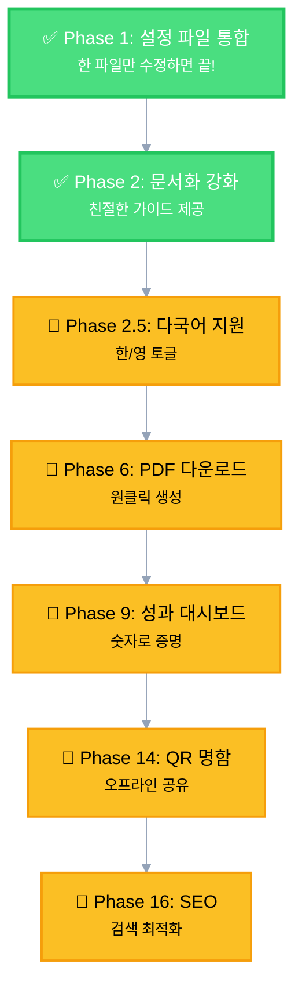

# 🎯 이력서 웹사이트

> **5분 만에 나만의 이력서 웹사이트 만들기** ✨  
> Next.js 16 + Tailwind CSS v4로 구축한 모던 웹 이력서

🔗 **Live**: [https://glossybigbro.github.io/](https://glossybigbro.github.io/)

---

## 💡 프로젝트 로드맵

> **⚠️ 로드맵 유연성**: 이 로드맵은 가이드일 뿐입니다. 실제 진행하면서 우선순위가 변경되거나, 일부 Phase를 건너뛰거나, 새로운 Phase가 추가될 수 있습니다.

이 프로젝트는 단순한 이력서 템플릿을 넘어, **누구나 쉽게 자신만의 이력서 웹사이트를 만들 수 있도록** 진화하고 있습니다.

### ✅ Core Features (필수)

#### Phase 1: 설정 파일 통합 (완료)

- **문제**: 여러 파일을 찾아다니며 수정해야 함
- **해결**: 한 파일(`resume.config.tsx`)만 수정하면 모든 정보가 업데이트
- **효과**: 초보자도 5분 만에 커스터마이징 가능

#### Phase 2: 문서화 강화 (완료)

- **문제**: 초보자는 어디서부터 시작해야 할지 모름
- **해결**: 상세한 가이드, 예시 템플릿, FAQ, 트러블슈팅 제공
- **효과**: 코딩 경험 없어도 따라할 수 있는 친절한 문서

#### Phase 2.5: 다국어 지원 (진행 예정)

- **문제**: 외국계 기업 지원 시 영문 이력서 필요
- **해결**: 한/영 토글로 두 버전 관리
- **효과**: 글로벌 채용 시장 대응, SEO 강화

#### Phase 6: PDF 다운로드 (진행 예정)

- **문제**: 채용 사이트는 PDF 업로드 필수
- **해결**: "PDF 다운로드" 버튼으로 원클릭 생성
- **효과**: 오프라인 공유, 채용 사이트 업로드 가능

#### Phase 9: 성과 지표 대시보드 (진행 예정)

- **문제**: 정량적 성과를 효과적으로 전달하기 어려움
- **해결**: 애니메이션 카운터, 프로그레스 바로 시각화
- **효과**: 채용 담당자가 가장 좋아하는 숫자로 증명

#### Phase 14: QR 코드 명함 (진행 예정)

- **문제**: 오프라인 네트워킹에서 웹사이트 공유 불편
- **해결**: QR 코드 스캔 → 웹사이트 바로 이동
- **효과**: 명함 인쇄, 즉시 공유

#### Phase 16: SEO 슈퍼차징 (진행 예정)

- **문제**: 검색 엔진에서 발견되기 어려움
- **해결**: JSON-LD, Open Graph, 성능 최적화
- **효과**: Google 검색 결과 상위 노출

### 🌟 Premium Features (차별화)

#### Phase 3.5: 애널리틱스 & 인사이트

- 누가 내 이력서를 봤는지, 어떤 섹션을 오래 보는지 분석

#### Phase 5.5: 소셜 프루프 통합

- GitHub 스타, Play Store 다운로드 수 실시간 표시

#### Phase 10: 스마트 컨택 폼

- 채용 담당자가 바로 연락할 수 있는 폼

#### Phase 17: 버전 관리

- 스타트업용, 대기업용, 외국계용 버전 전환

#### Phase 18: 인쇄 최적화

- A4 용지에 딱 맞는 인쇄 레이아웃

### 🎨 Advanced Features (선택)

#### Phase 3: 배포 자동화

- GitHub Pages, Vercel, Netlify 원클릭 배포

#### Phase 4: 테마 시스템

- Minimal, Modern, Classic 등 다양한 테마

#### Phase 4.5: 인터랙티브 요소

- 기술 스택 시각화, 프로젝트 타임라인, GitHub 잔디밭

#### Phase 8-lite: 이스터에그

- Konami Code 등 재미 요소

### ⏳ Long-term Features (장기)

#### Phase 5: CMS 통합

- Notion, Contentful 등과 연동하여 노션에서 글 쓰듯이 이력서 관리

> 💡 **현재 진행 상황**: Phase 1-2 완료! 이미 사용 가능한 템플릿입니다.  
> 다음 단계는 Phase 2.5 (다국어 지원)부터 시작합니다.

### 🗺️ 로드맵 시각화



---

## 📖 프로젝트 소개

개인의 **경력**, **프로젝트**, **기술 스택**을 효과적으로 전달하기 위한 정적 이력서 웹사이트입니다.  
Next.js 16의 App Router와 Tailwind CSS v4를 활용하여 최신 웹 기술 스택을 적용했으며,  
단순한 정보 전달을 넘어 **확장 가능한 아키텍처**와 **데이터 무결성**을 고려한 엔지니어링 프로젝트입니다.

---

## �🏗️ 아키텍처 및 엔지니어링 (Architecture & Engineering)

이 프로젝트는 단순한 정적 사이트가 아닙니다. 유지보수성과 확장성을 고려하여 **엔터프라이즈급 아키텍처**를 적용했습니다.

### 1. Container-Presenter 패턴

- **관심사의 분리**: 데이터 로직(`page.tsx`)과 UI 로직(`components/`)을 완벽하게 분리했습니다.
- **유지보수성**: UI 컴포넌트는 순수하게 렌더링에만 집중하며, 데이터 소스가 변경되어도 UI 코드는 수정할 필요가 없습니다.

### 2. 통합 설정 파일 (Unified Configuration)

- **단일 진실 공급원**: `src/resume.config.tsx` 파일 하나에 모든 이력서 데이터를 통합했습니다.
- **쉬운 커스터마이징**: 여러 파일을 찾아다닐 필요 없이 한 파일만 수정하면 모든 정보가 업데이트됩니다.
- **하위 호환성**: 기존 데이터 파일들은 re-export 방식으로 유지되어 기존 코드와 완벽하게 호환됩니다.

### 3. 데이터 무결성 검증 (Data Integrity)

- **Zod**: `src/schemas`에 정의된 강력한 스키마를 통해 모든 데이터의 유효성을 런타임에 검증합니다.
- **Single Source of Truth**: TypeScript 타입 정의가 Zod 스키마로부터 자동 추론되어, 문서와 코드 간의 불일치를 원천 차단했습니다.
- **Vitest**: 데이터 파일이 스키마를 준수하는지 확인하는 자동화 테스트(`npm test`)를 구축하여, 배포 전 오류를 사전에 방지합니다.

### 4. 체계적인 스타일 시스템 (Design System)

- **CVA (Class Variance Authority)**: `Tag`, `Button` 등 UI 컴포넌트의 스타일 변형(Variant)을 선언적으로 관리합니다.
- **Tailwind CSS v4**: 최신 엔진을 사용하여 빌드 성능을 극대화하고, 불필요한 CSS를 제거했습니다.
- **4-Way 테마 시스템**: Chrome 시스템 테마와 웹사이트 테마 토글을 모두 감지하여 4가지 조합에서 각각 다른 스타일 제공 (`@media (prefers-color-scheme)` + `.dark` 클래스)
- **View Transitions API**: 랜덤 위치에서 원형으로 퍼져나가는 부드러운 테마 전환 애니메이션

### 5. 모바일 UX 최적화 (Mobile UX Optimization)

- **useIsMobile 훅**: User Agent 기반 모바일 기기 감지로 터치 디바이스와 마우스 디바이스를 구분합니다.
- **조건부 호버 효과**: 데스크탑에서만 호버 애니메이션을 활성화하여 모바일에서 터치 후 스타일이 남는 문제를 방지합니다.
- **일관된 인터랙션**: 모든 버튼과 링크가 기기 타입에 맞는 최적화된 사용자 경험을 제공합니다.

### 6. 검색 엔진 최적화 (SEO Optimization)

- **동적 메타데이터 생성**: `src/config/site.ts`와 `src/data/skills.ts`의 데이터를 결합하여 풍부한 메타데이터(Open Graph, Twitter Cards)를 자동 생성합니다.
- **자동 사이트맵/Robots 생성**: 빌드 시점에 `sitemap.xml`과 `robots.txt`를 자동으로 생성하여 검색 엔진 색인을 돕습니다.
- **스마트 키워드 추출**: 보유 기술 스택(`skills.ts`)을 자동으로 SEO 키워드로 변환하여, 실제 역량과 검색 결과의 일치도를 높였습니다.

---

## 🛠️ 기술 스택 (Tech Stack)

### Core

| 기술 | 버전 | 설명 |
|------|------|------|
| **Next.js** | 16.x | App Router, Server Components, SSG |
| **TypeScript** | 5.x | Strict Type Checking |
| **React** | 19.x | UI Library |

### Libraries & Tools

| 기술 | 설명 |
|------|------|
| **Zod** | Schema Validation & Type Inference |
| **Vitest** | Unit Testing & Data Integrity Check |
| **CVA** | Component Style Variants Management |
| **Tailwind CSS** | v4 Utility-first CSS |

---

## 📂 프로젝트 구조 (Project Structure)

```text
glossybigbro.github.io/
├── src/
│   ├── resume.config.tsx        # 🎯 통합 설정 파일 (여기만 수정하세요!)
│   ├── app/                     # Container (데이터 주입)
│   ├── components/              # Presenter (순수 UI)
│   │   ├── sections/            # 페이지 섹션
│   │   └── ui/                  # 재사용 가능한 UI 컴포넌트 (CVA 적용)
│   ├── config/                  # ⚙️ 사이트 설정 (메타데이터 등)
│   ├── constants/               # 🎯 상수 정의 (UI 설정, 애니메이션 등)
│   ├── data/                    # 📝 데이터 파일 (하위 호환성용)
│   │   ├── __tests__/           # ✅ 데이터 무결성 테스트 (Vitest)
│   │   └── ...                  # resume.config.tsx에서 re-export
│   ├── schemas/                 # 🛡️ Zod 스키마 (검증 규칙)
│   ├── types/                   # Zod 추론 타입 (Single Source of Truth)
│   └── utils/                   # 순수 유틸리티 함수
└── ...
```

---

## 📄 페이지 구성 (Page Structure)

| 섹션 | 내용 | 주요 기능 |
|------|------|----------|
| **Header** | 이름, 직함, 연락처, 소셜 링크 | 이메일 클릭 시 클립보드 복사 |
| **Introduce** | 자기소개, 핵심 가치 | 프로필 이미지 포함 |
| **Experience** | 경력 사항, 주요 업무 | 총 경력 자동 계산 |
| **Project** | 프로젝트 목록, 역할 | 기간별 정렬, 태그 시스템 |
| **Skill** | 기술 스택, 도구 | 카테고리별 분류 |
| **Writing** | 작성한 글, 아티클 | 외부 링크 연결 |

---

## 🚀 내 이력서로 만들기 (Step-by-Step Guide)

### 1️⃣ Fork & Clone

```bash
# 1. GitHub에서 이 저장소를 Fork 합니다 (우측 상단 Fork 버튼)

# 2. Fork한 저장소를 클론합니다
git clone https://github.com/YOUR_USERNAME/glossybigbro.github.io.git
cd glossybigbro.github.io

# 3. 의존성 설치
npm install
```

### 2️⃣ Repository 이름 변경 (중요!)

GitHub Pages를 `https://YOUR_USERNAME.github.io` 주소로 사용하려면:

1. GitHub Repository 페이지에서 `Settings` 클릭
2. `Repository name`을 `YOUR_USERNAME.github.io`로 변경
   - 예: `john.github.io`, `jane-doe.github.io`
3. `Rename` 버튼 클릭

> **참고:** 다른 이름(예: `my-portfolio`)을 사용하려면 `next.config.ts`의 `basePath` 주석을 해제하고 수정해야 합니다.

### 3️⃣ 데이터 수정 (가장 중요!)

**🎯 `src/resume.config.tsx` 파일 하나만 수정하면 됩니다!**

이 파일에 모든 이력서 정보가 통합되어 있습니다:

```typescript
// src/resume.config.tsx

// 📌 헤더 정보
export const header: HeaderData = {
    name: "당신의 이름",
    title: "당신의 직함",
    email: "your@email.com",
    github: "https://github.com/username",
    // ...
};

// 📌 자기소개
export const introduce = {
    title: "Introduce.",
    profileImage: "/images/profile.jpeg",
    content: [
        <p key="p1">
            당신의 자기소개를 작성하세요...
        </p>,
        // ...
    ]
};

// 📌 경력
export const experience: ExperienceItem[] = [
    {
        id: "exp-1",
        period: "2022.08 ~ 2025.01",
        role: "회사명",
        description: ["주요 업무 1", "주요 업무 2"],
        tags: ["기술1", "기술2"],
    },
    // ...
];

// 📌 프로젝트, 기술 스택, 작성 글도 동일한 파일에 있습니다!
```

> 💡 **팁**: 파일 내부의 JSDoc 주석을 참고하면 각 필드의 의미와 예시를 확인할 수 있습니다.

> 📝 **예시 템플릿**: `src/resume.config.example.tsx` 파일에 다양한 직군별 예시가 준비되어 있습니다. 참고하세요!

### 4️⃣ 프로필 이미지 교체

```bash
# public/images/profile.jpeg 파일을 본인 사진으로 교체
# 권장 사이즈: 400x400px 이상 (정사각형)
```

### 5️⃣ 로컬에서 미리보기

```bash
# 로컬 개발 서버 실행
npm run dev
# http://localhost:3000 에서 확인

# 프로덕션 빌드 테스트
npm run build
```

### 6️⃣ GitHub Pages 배포 설정

### 방법 1: GitHub Actions (권장)

1. GitHub Repository > `Settings` > `Pages`
2. `Source`를 **GitHub Actions**로 선택
3. 코드를 `main` 브랜치에 푸시하면 자동 배포됩니다

   ```bash
   git add .
   git commit -m "feat: 내 이력서로 커스터마이징"
   git push origin main
   ```

4. `Actions` 탭에서 배포 진행 상황 확인
5. 완료되면 `https://YOUR_USERNAME.github.io`에서 확인!

### 방법 2: 수동 배포 (선택사항)

```bash
npm run deploy
```

### 7️⃣ 배포 완료! 🎉

- 배포 주소: `https://YOUR_USERNAME.github.io`
- 배포 시간: 약 2-3분 소요
- 수정 후 다시 푸시하면 자동으로 재배포됩니다

---

## ❓ 자주 묻는 질문 (FAQ)

### Q1: 데이터를 수정하려면 어떤 파일을 편집해야 하나요?

**A**: `src/resume.config.tsx` 파일 하나만 수정하면 됩니다! 이 파일에 모든 이력서 데이터(헤더, 소개, 경력, 프로젝트, 기술 스택, 작성 글)가 통합되어 있습니다.

### Q2: 기존 `src/data/` 폴더의 파일들은 어떻게 되나요?

**A**: 기존 파일들은 하위 호환성을 위해 유지되며, `resume.config.tsx`에서 데이터를 re-export합니다. 직접 수정하지 않아도 됩니다.

### Q3: 예시 데이터를 참고하고 싶어요

**A**: `src/resume.config.example.tsx` 파일에 다양한 직군별 예시가 준비되어 있습니다. 이 파일을 참고하여 본인의 정보로 수정하세요.

### Q4: 프로필 이미지는 어떻게 변경하나요?

**A**: `public/images/profile.jpeg` 파일을 본인의 사진으로 교체하면 됩니다. 권장 사이즈는 400x400px 이상의 정사각형입니다.

### Q5: 특정 섹션을 숨기고 싶어요

**A**: `resume.config.tsx`에서 해당 섹션의 데이터를 빈 배열(`[]`)로 설정하거나, 컴포넌트 레벨에서 조건부 렌더링을 추가할 수 있습니다.

### Q6: 다크 모드는 어떻게 작동하나요?

**A**: 시스템 테마와 웹사이트 테마 토글을 모두 지원합니다. 우측 상단의 테마 토글 버튼으로 수동 전환이 가능하며, View Transitions API를 사용한 부드러운 애니메이션이 적용됩니다.

### Q7: 배포 후 수정사항을 반영하려면?

**A**: `resume.config.tsx` 파일을 수정하고 Git에 커밋/푸시하면 GitHub Actions가 자동으로 재배포합니다. 약 2-3분 후 변경사항이 반영됩니다.

### Q8: 여러 언어 버전을 만들 수 있나요?

**A**: 현재는 단일 언어만 지원합니다. 다국어 지원이 필요하다면 `resume.config.tsx`를 언어별로 분리하거나, i18n 라이브러리를 추가로 통합해야 합니다.

### Q9: SEO 최적화는 어떻게 되어 있나요?

**A**: `src/config/site.ts`에서 메타데이터를 자동 생성하며, 기술 스택 데이터를 SEO 키워드로 활용합니다. `sitemap.xml`과 `robots.txt`도 자동 생성됩니다.

### Q10: 커스텀 도메인을 연결하고 싶어요

**A**: GitHub Pages 설정에서 Custom Domain을 추가할 수 있습니다:

1. Repository Settings > Pages > Custom domain에 도메인 입력
2. DNS 설정에서 CNAME 레코드 추가 (`YOUR_USERNAME.github.io` 가리키도록)
3. HTTPS 활성화 (GitHub에서 자동 처리)

---

## 🤝 기여하기 (Contributing)

이 프로젝트를 개선하고 싶으시다면:

1. Fork the repository
2. Create your feature branch (`git checkout -b feature/amazing-feature`)
3. Commit your changes (`git commit -m 'feat: Add amazing feature'`)
4. Push to the branch (`git push origin feature/amazing-feature`)
5. Open a Pull Request

---

## 📄 라이선스 (License)

이 프로젝트는 개인 이력서 템플릿으로 자유롭게 사용 가능합니다.  
Fork하여 본인의 이력서로 만들어 사용하세요!

---

## 👤 작성자

### 하윤형 (Ha Yun-hyeong)

- Email: <glossy.bigbro@gmail.com>
- GitHub: [@glossybigbro](https://github.com/glossybigbro)

## 🔧 문제 해결 (Troubleshooting)

### ❌ 빌드가 실패해요

**증상**: `npm run build` 실행 시 에러 발생

**해결 방법**:

1. Node.js 버전 확인

   ```bash
   node --version  # 16.x 이상이어야 함
   ```

2. 의존성 재설치

   ```bash
   rm -rf node_modules package-lock.json
   npm install
   ```

3. 캐시 삭제

   ```bash
   npm run clean  # 또는 rm -rf .next
   ```

### ❌ 배포 후 404 에러가 나요

**증상**: GitHub Pages에서 페이지가 안 보임

**해결 방법**:

1. Repository 이름 확인
   - `YOUR_USERNAME.github.io` 형식이어야 함
   - 다른 이름이면 `next.config.ts`에서 `basePath` 설정 필요

2. GitHub Pages 설정 확인
   - Settings > Pages > Source를 "GitHub Actions"로 설정
   - `main` 브랜치에 코드가 푸시되어 있는지 확인

3. Actions 탭에서 배포 로그 확인
   - 빌드 에러가 있는지 확인

### ❌ 데이터 수정했는데 반영이 안 돼요

**증상**: `resume.config.tsx` 수정 후에도 변경사항이 안 보임

**해결 방법**:

1. 개발 서버 재시작

   ```bash
   # Ctrl+C로 중단 후
   npm run dev
   ```

2. 브라우저 캐시 삭제 (Cmd+Shift+R 또는 Ctrl+Shift+R)
3. `.next` 폴더 삭제 후 재빌드

   ```bash
   rm -rf .next
   npm run dev
   ```

### ❌ 이미지가 안 보여요

**증상**: 프로필 이미지나 다른 이미지가 표시되지 않음

**해결 방법**:

1. 이미지 경로 확인
   - `public/images/` 폴더에 이미지가 있는지 확인
   - 파일명 대소문자 정확히 일치하는지 확인

2. 이미지 형식 확인
   - `.jpg`, `.jpeg`, `.png`, `.webp` 지원
   - 파일 크기가 너무 크지 않은지 확인 (권장: 1MB 이하)

### ❌ 타입 에러가 발생해요

**증상**: TypeScript 타입 에러

**해결 방법**:

1. `resume.config.tsx`의 데이터 형식 확인
   - 각 필드가 올바른 타입인지 확인
   - 필수 필드가 누락되지 않았는지 확인

2. 예시 템플릿 참고

   ```bash
   # resume.config.example.tsx 파일 참고
   ```

### 💡 그래도 해결이 안 된다면?

1. [GitHub Issues](https://github.com/glossybigbro/glossybigbro.github.io/issues)에 질문 남기기
2. 에러 메시지 전체를 복사해서 공유하기
3. 어떤 단계에서 문제가 발생했는지 설명하기

---
